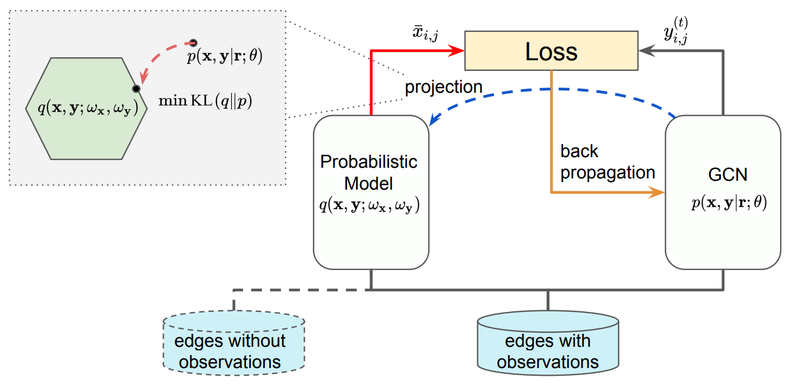

# GCN-KL

This is a TensorFlow implementation of the GCN-KL model as described in our paper:
 
Xujiang Zhao, Feng Chen, Jin-Hee Cho [Uncertainty-Based Opinion Inference on Network Data Using Graph Convolutional Neural Networks](https://ieeexplore.ieee.org/abstract/document/8599840), MILCOM (2018)

GCN-KL model are end-to-end trainable neural network models for uncertain opinions prediction in a network data.. 




## Installation

1. Clone this repository.
   ```sh
   git clone https://github.com/zxj32/GCN-KL
   cd GCN-KL
   ```

2. Install the dependencies. The code should run with TensorFlow 1.0 and newer.
   ```sh
   pip install -r requirements.txt  # or make install
   ```

## Requirements
* TensorFlow (1.0 or later)
* python 2.7
* networkx
* scikit-learn
* scipy

## Run the demo

```bash
python opinion_KL.py
```

## Data

In order to use your own data, you have to provide 
* an N by N adjacency matrix (N is the number of nodes), and
* an N by D feature matrix (D is the number of features per node) -- optional

Have a look at the `load_load_data_traffic` function in `traffic_data/read_data.py` for an example.

In this example, we load traffic data. The original datasets can be found here: http://inrix.com/publicsector.asp


## Models

You can choose the following model: 
* `GCN-KL`: opinion_KL.py

## Question

If you have any question, please feel free to contact me. Email is good for me. 

## Cite

Please cite our paper if you use this code in your own work:

```
@article{xujiang2018gcn_kl,
  title={Uncertainty-Based Opinion Inference on Network Data Using Graph Convolutional Neural Networks},
  author={Xujiang Zhao, Feng Chen and Jin-Hee Cho},
  journal={MILCOM},
  year={2018}
}
```
